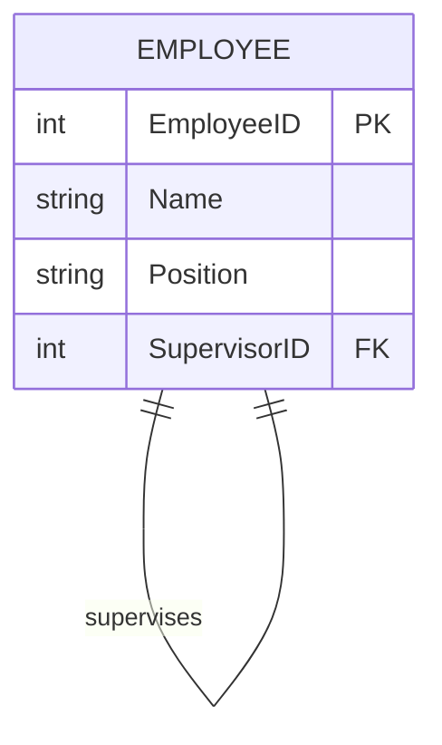
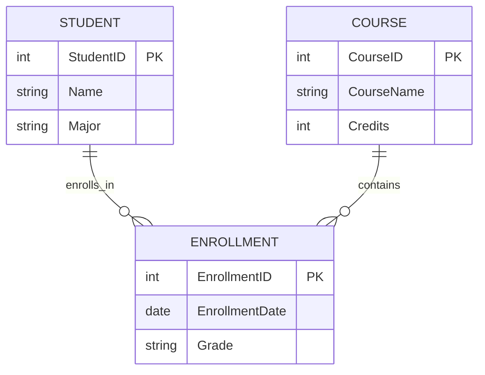
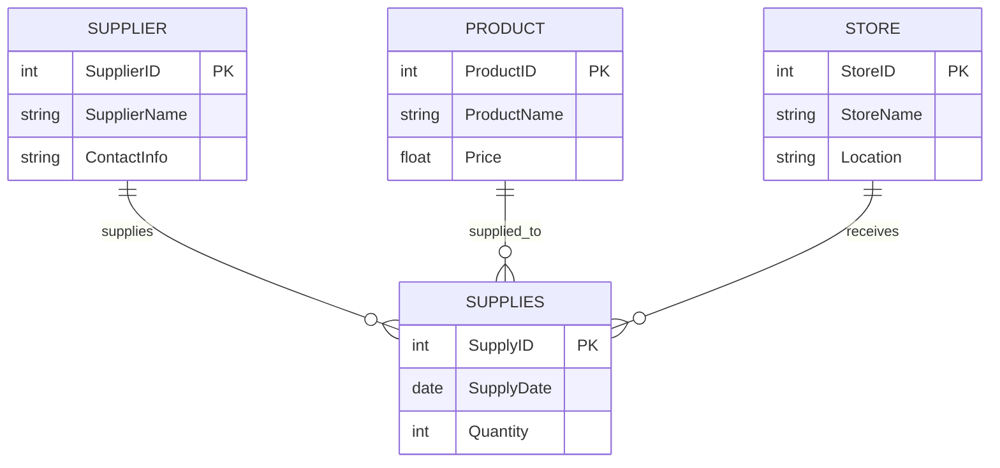
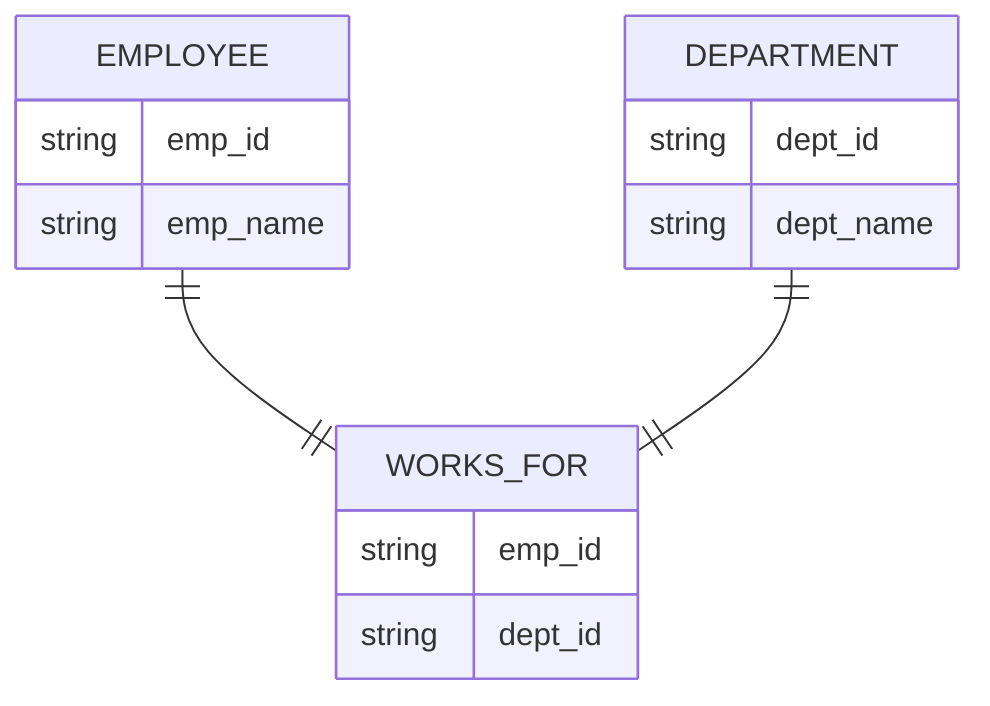
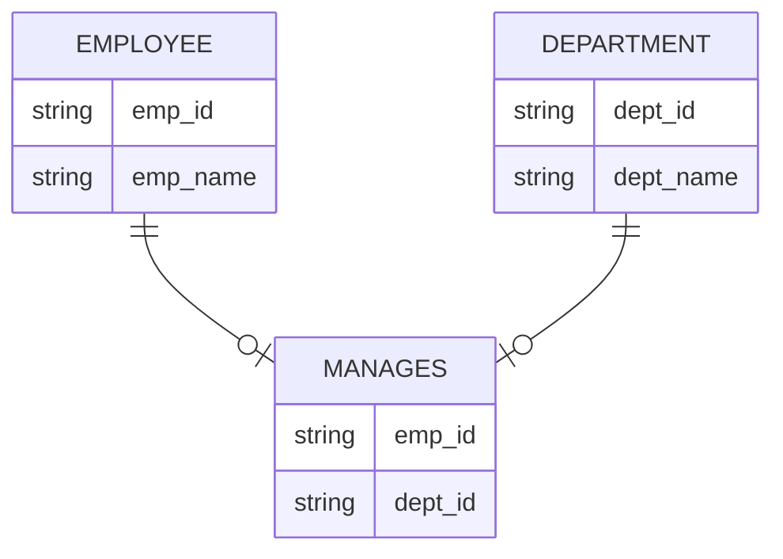

### E-R data model concepts

1. **Entity**

- An entity is a "thing" or "object" in the real world that can be identified and distinguished from other objects.
- Example: Each student in a university is an entity.

2. **Entity Set**

- An entity set is a collection of entities of the same type that share the same properties or attributes.
- Example: All students at a university form a Student entity set.

3. **Attributes**

- Attributes are descriptive properties or characteristics of an entity.
- Each entity is represented by a set of attributes. 
- For example, a Student entity might have attributes like Name, ID, Age, and Major.

4. **Relationship Sets**

- Relationships describe associations between two or more entities.
- A relationship set consists of relationships of the same type between different entity sets (e.g., a “Takes” relationship between Students and Courses).

---
----

### Complex Attributes in the E-R model

1. **Simple and Composite Attributes**

- Simple Attribute: Cannot be divided further.
- Example: Age, ID

- Composite Attribute: Can be broken down into smaller components.
- Example: Full Name (can be split into First Name and Last Name)

- Multi-Valued Attribute: Can hold multiple values for each entity.
- Example: A person’s Phone Numbers (can have more than one).

    

2. complex attribute : multivalued + composite

3. **Derived Attributes**

- Derived Attribute: Its value is calculated or derived from other attributes.
- Example: Age can be derived from the Date of Birth.

4. **stored attribute**

- The stored attribute is an attribute that is physically stored in the database. Assume a table called a student. There are attributes such as student_id, name, roll_no, and course_Id. 
- We cannot derive the value of these attributes using other attributes. So, these attributes are called stored attributes.

5. **Null Values**

- An attribute has a null value when an entity does not have a value for it.
- **Reasons for Null Values:**
- Not Applicable: The attribute does not apply to the entity.
- Example: A car may not have an insurance policy number if it’s not insured.
- Missing Data: The value is unknown or not provided.

![[Screenshot from 2024-12-15 21-38-57.png]]

---
---
### **1. Degree of Relationship**

- The degree of a relationship refers to the number of entity sets involved in it.

 a. **Unary Relationship (Degree 1)**

- A relationship involving a single entity set.
- Example: _"Employee supervises another Employee."

 b. **Binary Relationship (Degree 2)**

- A relationship involving two entity sets.
- Example: _"Student enrolls in Course."_

 c. **Ternary Relationship (Degree 3)**

- A relationship involving three entity sets.
- Example: _"Supplier supplies Product to Store."

---

### Cardinality of Relationship

- The cardinality defines the number of instances of one entity associated with instances of another

### Types of Mapping Cardinalities

1. **One-to-One (1:1)**

- Each entity in A is associated with at most one entity in B, and vice versa.
- Example: A person is assigned to one passport, and each passport corresponds to one person.

2. **One-to-Many (1:M)**

- An entity in A can be associated with many entities in B, but each entity in B is associated with at most one entity in A.
- Example: One professor can teach many courses, but each course is taught by only one professor.

3. **Many-to-One (M:1)**

- An entity in A is associated with at most one entity in B, but each entity in B can be associated with many entities in A.
- Example:Many employees work in the same department, but each employee is assigned to only one department.

4. **Many-to-Many (M:M)**

- An entity in A can be associated with any number of entities in B, and vice versa.
- Example: Students can enroll in many courses, and each course can have many students.
![[Screenshot from 2024-12-15 21-43-18.png]]

---
---

### Participation in Relationship

- The participation indicates whether all entities are involved in a relationship.

### Types of Participation

1. **Total Participation**

- Every entity in the entity set E must participate in at least one relationship in the relationship set R.
- Example:In a "Works_For" relationship between Employees and Departments, every employee must be assigned to a department.
- **Notation in E-R Diagram:** Double line connects the entity set to the relationship set.

2. **Partial Participation**

- Some entities in the entity set E may not participate in any relationship in the relationship set R.
- Example: In a "Manages" relationship between Employees and Departments, not every employee needs to manage a department; only some do.
- **Notation in E-R Diagram:** Single line connects the entity set to the relationship set.

![[Screenshot from 2024-12-15 21-48-48.png]]

---
---

### Weak Entity

- **A weak entity set is an entity set that:**
    
- Cannot be uniquely identified by its own attributes alone.
    
- Depends on a related strong entity set (called the identifying entity set) for its existence.
    
- Requires discriminator attributes (extra attributes) along with the primary key of the identifying entity to form its own primary key.

    ![[Untitled-Diagram-231.png]]

** Primary Key of a Weak Entity Set**

- The primary key of a weak entity is a combination of:
    
- Primary key of the identifying entity set (Course ID).
    
- Discriminator attributes of the weak entity (Section ID, Year, Semester).
